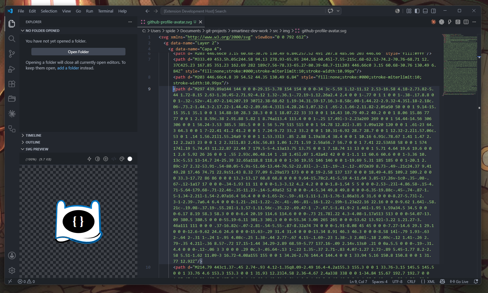

# Better SVG Safe


<p align="center">
  A Visual Studio Code extension for previewing, inspecting, and safely optimizing SVG files and inline SVG code.
</p>

<p align="center">
  <a href="https://marketplace.visualstudio.com/items?itemName=emartinez-dev-work.better-svg-safe">VS Marketplace</a>
  |
  <a href="#why-this-fork-exists">Why this fork exists</a>
  |
  <a href="#features">Features</a>
  |
  <a href="#configuration">Configuration</a>
</p>

<p align="center">
  <a href="https://code.visualstudio.com/">
    
  </a>
  
  
  
</p>

## Why this fork exists

I write software professionally, but in my free time I also enjoy designing small assets and visual ideas for personal projects. A common part of that workflow is creating graphics in Adobe Illustrator, exporting them as SVG, and then integrating them into apps, prototypes, or animated experiences.

SVG is perfect for that kind of work: it scales cleanly, stays editable, can be styled with CSS, and can be animated or converted into formats used by tools such as Lottie. The problem I ran into was not SVG itself, but what happened after export.

When I tried to attach some Illustrator-generated SVGs to AI design and prototyping tools, including Claude and Google Stitch, the files could break or render incorrectly. Those platforms did not always interpret the full SVG structure in the same way a browser or design tool would.

I looked for a practical way to simplify those SVGs before handing them to other tools and found [Better SVG](https://github.com/midudev/better-svg) by Miguel Angel Duran. It felt clean, focused, and nicely integrated into VS Code, which is where I already spend most of my development time.

The issue was that the existing **Optimize SVG** workflow still broke the SVGs in my case. In particular, class-based styling exported from design tools could be removed before it had been safely preserved, so the optimized output was smaller but visually wrong.

Instead of opening a bug report or pull request for a scenario I was not sure was common, I created this fork to solve the workflow I needed:

- keep the existing preview and optimization experience;
- preserve class-driven visual styles before removing class attributes;
- avoid unnecessary SVG size regressions;
- add a **Code Interactive** mode for inspecting rendered SVG elements from the preview.

> [!NOTE]
> Better SVG Safe is a personal fork of Better SVG, adapted for the workflow described above. Original attribution is preserved in the project notices and source headers.

## Features

- Preview standalone `.svg` files directly inside VS Code.
- Keep an Explorer **SVG Preview** panel in sync with the active SVG file.
- Hover inline SVG code in supported files to see a quick preview.
- Show gutter preview icons next to SVG definitions.
- Optimize standalone SVG files with SVGO while preserving shared class-based styles.
- Optimize inline SVGs while keeping framework-specific syntax intact.
- Use **Code Interactive** mode to click rendered SVG elements and jump to their source line.
- Adjust zoom, pan, centering, dark background, and `currentColor` while previewing.

## Safer SVG optimization

Better SVG Safe changes the standalone optimization path so SVGs exported from design tools are less likely to lose their appearance during cleanup.

When `betterSvg.removeClasses` is enabled, the extension configures SVGO to inline all matched class-based styles before class attributes are removed. This matters for SVGs that contain shared CSS rules inside `<style>` blocks, a pattern commonly produced by design tools.

The optimizer also removes unreferenced internal IDs while keeping surviving ID names stable. That allows SVGO to collapse unnecessary wrapper groups without renaming IDs that external CSS or JavaScript might still depend on.

## Code Interactive mode

The SVG Preview toolbar includes a `</>` toggle for inspecting the rendered SVG.

When enabled, Better SVG Safe formats the active standalone SVG so each element has a stable source line. Then, inside the preview:

- hover elements to see a shape-aware highlight;
- click an element to reveal and select its source line in the editor;
- run optimization safely after the mode is automatically disabled.

The internal line mapping uses temporary `data-besvg-line` attributes inside the webview only. Those attributes are not written back to your SVG file.

## Supported files

Better SVG Safe works with standalone SVG files and inline SVG syntax in common frontend formats:

| Type | Extensions |
|------|------------|
| Static | `.svg`, `.xml` |
| React | `.jsx`, `.tsx` |
| Vue | `.vue` |
| Astro | `.astro` |
| Svelte | `.svelte` |
| Templates | `.html`, `.liquid`, `.php`, `.ejs`, `.erb`, `.django-html` |

## Configuration

Customize the extension through **Settings -> Extensions -> Better SVG Safe**:

| Setting | Type | Default | Description |
|---------|------|---------|-------------|
| `betterSvg.autoReveal` | `boolean` | `true` | Automatically reveal and expand the SVG Preview panel when opening SVG files. |
| `betterSvg.autoCollapse` | `boolean` | `true` | Automatically collapse the SVG Preview panel when no SVG files are active. |
| `betterSvg.enableHover` | `boolean` | `true` | Enable hover previews over SVG code. |
| `betterSvg.showGutterPreview` | `boolean` | `true` | Show small preview icons next to line numbers in the gutter. |
| `betterSvg.defaultColor` | `string` | `"#ffffff"` | Hex color used to replace `currentColor` in previews. |
| `betterSvg.removeClasses` | `boolean` | `true` | Remove `class` attributes after preserving class-bound styles during optimization. |

## Development

```bash
corepack pnpm install
corepack pnpm test
corepack pnpm check
corepack pnpm package
```

## Credits

Better SVG Safe is based on [Better SVG](https://github.com/midudev/better-svg) by Miguel Angel Duran. This personal fork keeps the original attribution and Apache 2.0 notices while adding changes focused on safer design-tool SVG optimization and preview-to-code inspection.
